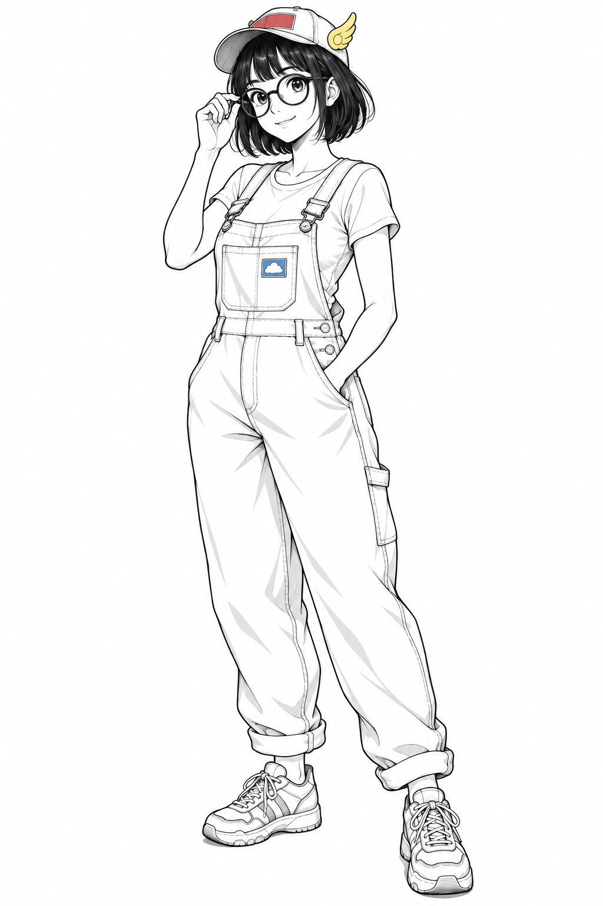
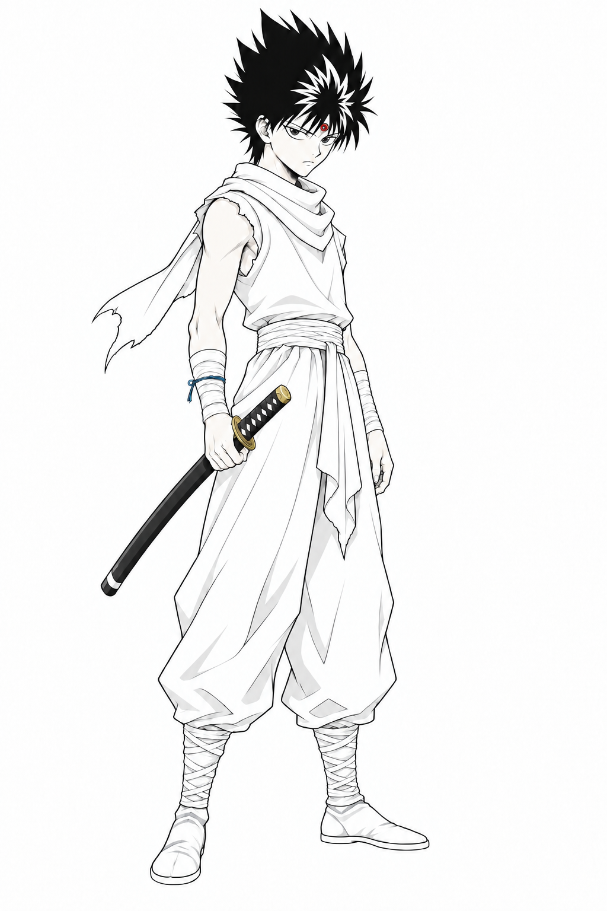
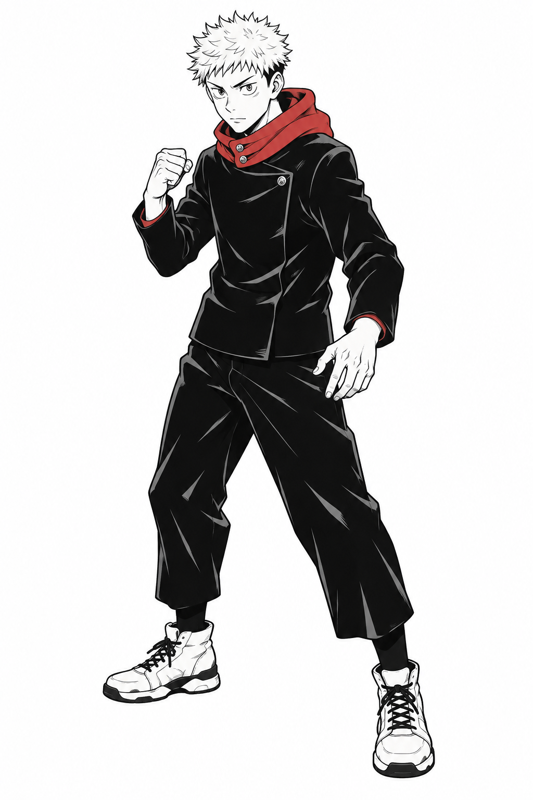
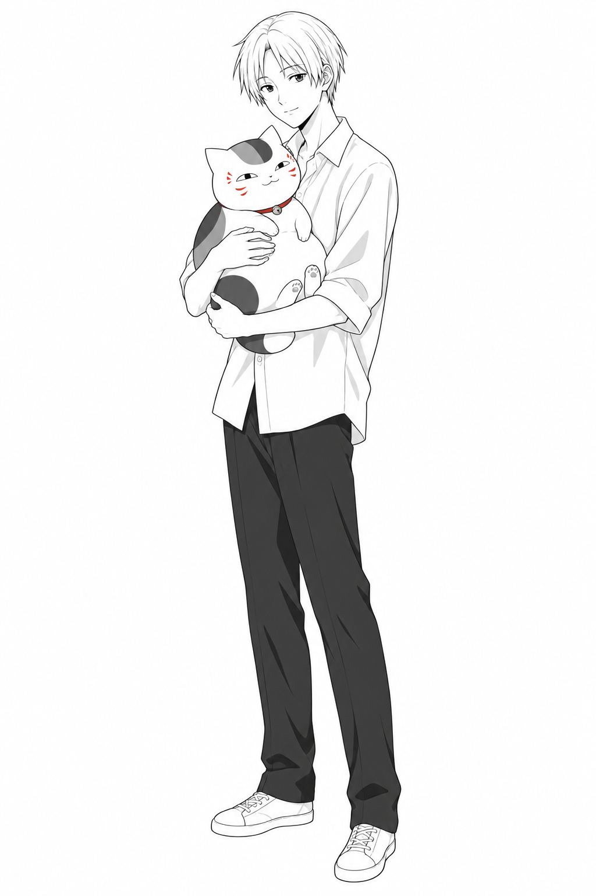
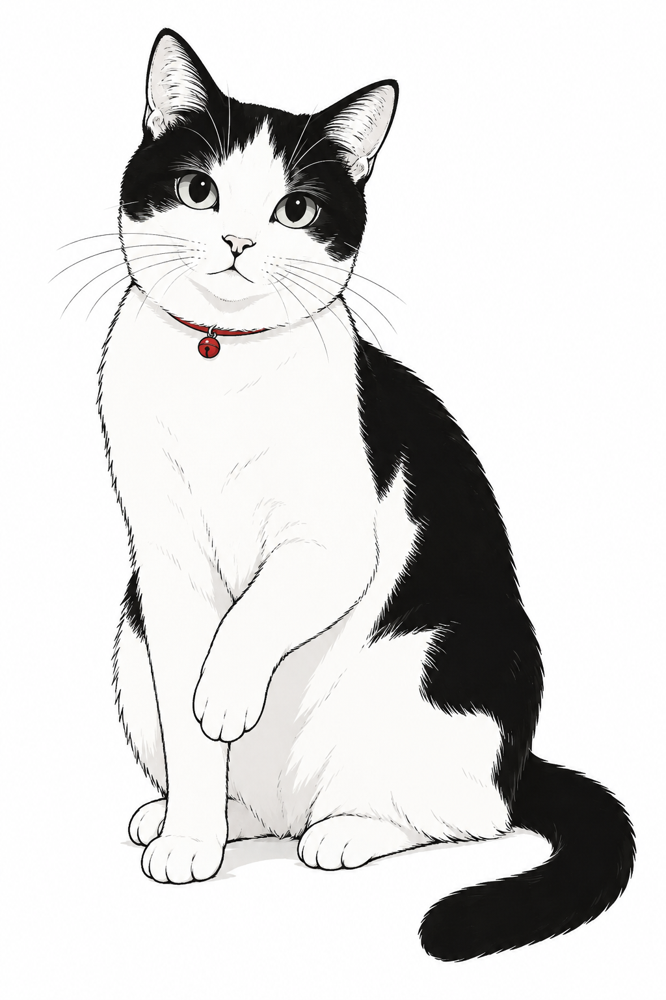
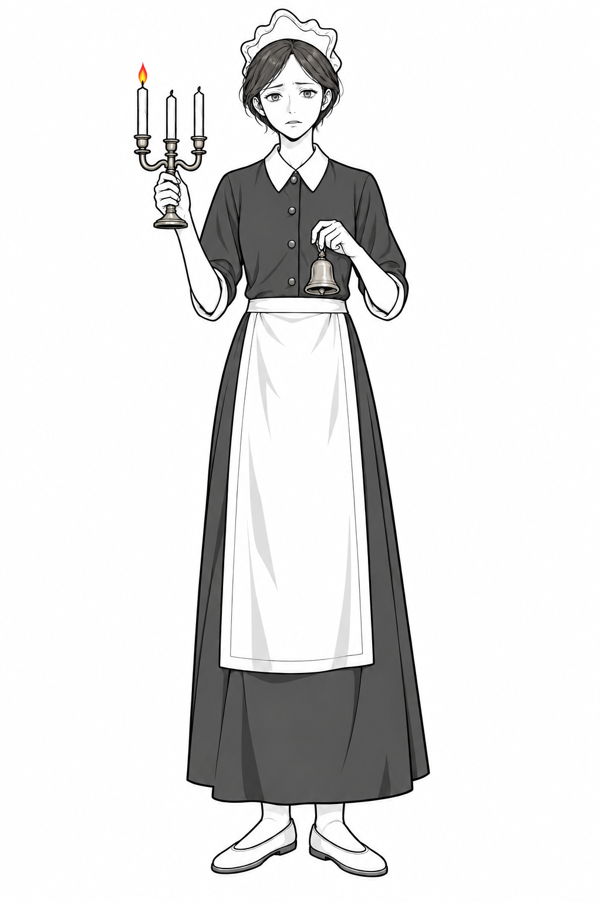
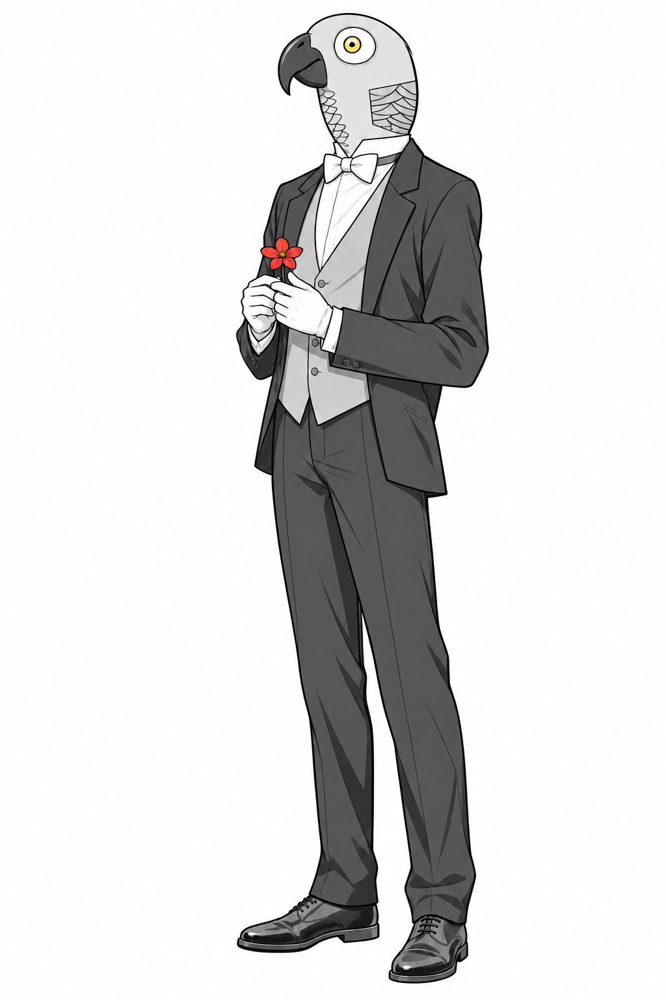

# 盒盒小墨点 · 黑白线稿与红黄蓝点缀

  

  
  
  

> 把照片、角色设想或游戏截图，转成**自然比例、纯白底、黑白细线**的单幅角色插画；红、黄、蓝只留给真正需要被看见的小细节。

**hehe-xiaomodian-ryb** 适合人物、宠物、动物头兽人和角色立绘。它关注身份锚点、骨架、衣物深浅和留白，而不是把原图的光影与材质逐像素搬过来。

## 一眼认识小墨点

| 画面 | 角色 | 留白 | 点色 |
| --- | --- | --- | --- |
| 清晰的黑色手绘线 | 自然头身与可信结构 | 纯白、无纹理背景 | 红黄蓝 1–3 处小细节 |

- **人和动物都要站得住。** 不做大头小身或幼态 Q 版。
- **浅色皮肤留白。** 只有黑色或棕色皮肤设定的人物保留对应干净底色。
- **衣物按固有色处理。** 浅色衣物主要留白，深色衣物可用稳定黑灰块面。
- **颜色有明确用途。** 可点在眼影、彩妆、唇色、瞳色、伤疤、花钿、配饰或道具上；不把浅色皮肤铺成肤色。

## 安装

克隆仓库后，把 <code>skills/hehe-xiaomodian-ryb/</code> 复制到客户端的 Skill 目录。

~~~text
Codex:  ~/.codex/skills/hehe-xiaomodian-ryb/
Claude: ~/.claude/skills/hehe-xiaomodian-ryb/
~~~

新开会话后，可以这样调用：

~~~text
使用 $hehe-xiaomodian-ryb 把这张照片改成黑白简笔画。
~~~

## 示例画廊

以下示例**均由 Codex 生成**。生图效果会受模型能力、提示词、参考图质量和生成轮次影响；它们展示的是小墨点要控制的画面方向，不代表每次都会得到相同结果。

### 01 · 阿拉蕾（成年版）

  

~~~text
帮我用小墨点生成一张鸟山明漫画角色阿拉蕾的成年版：自然成人比例，圆框眼镜、棒球帽、背带裤和运动鞋，纯白背景，黑白细线。帽檐用红色、帽侧小翅膀用黄色、胸前小徽章用蓝色作小面积点缀；皮肤保持白色留白。
~~~

**观察重点：** 圆框眼镜、帽子小翅膀和背带裤保留身份感；大面积仍由白底、黑线和浅灰衣褶组成。

### 02 · 飞影

  

~~~text
帮我用小墨点生成一张《幽游白书》中的飞影：自然少年比例，黑色刺发、额头邪眼、围巾、绑带和持刀站姿，纯白背景，黑白细线。邪眼用一粒红色、腕部绳结用少量蓝色、刀镡用少量黄色点缀；皮肤保持白色留白。
~~~

**观察重点：** 用完整黑色发型和刀的轮廓建立气质，红色只服务于额头邪眼。

### 03 · 虎杖悠仁

  

~~~text
帮我用小墨点生成一张《咒术回战》中的虎杖悠仁：自然少年比例，短刺发，深色校服，战斗前的稳固站姿，纯白背景，黑白细线。连帽领或内衬只用一处红色作为小面积点缀；皮肤保持白色留白。
~~~

**观察重点：** 深色校服可以用整片黑灰表达本色，红色只用来提示服装结构。

### 04 · 夏目贵志与猫咪老师

  

~~~text
帮我用小墨点生成一张《夏目友人帐》中的夏目贵志抱着猫咪老师：自然少年比例，浅色衬衣、深色长裤，怀中猫咪老师保持圆润体态和脸部纹样，纯白背景，黑白细线。猫咪老师的脸纹和项圈只用少量红色；两者皮肤与毛色以白色留白为主。
~~~

**观察重点：** 人物和宠物作为一个安静的单幅主体，猫咪老师的脸纹与项圈承担全部色彩记忆点。

### 05 · 奶牛猫

  

~~~text
帮我用小墨点生成一张坐姿奶牛猫：自然猫科骨架，黑白斑块清晰，尾巴自然落地，纯白背景，黑白细线与少量浅灰阴影。红色细项圈作为唯一点色。
~~~

**观察重点：** 黑白花纹必须干净地围绕猫的结构展开，红项圈只作为轻微的识别信号。

### 06 · 锈湖女仆

  

~~~text
帮我用小墨点把锈湖女仆角色改成黑白简笔画：保留女仆发帽、深色长裙、白围裙、三头烛台和手中的铃铛，采用自然成人比例，纯白背景，黑白细线。皮肤留白；烛焰仅用红黄小点。
~~~

**观察重点：** 场景、家具与截图界面被删除，只留下服装、烛台和铃铛三个身份锚点。

### 07 · 锈湖鹦鹉头男士

  

~~~text
帮我用小墨点把锈湖的鹦鹉头男士改成黑白简笔画：保留钩喙、圆眼、颈侧羽片、深色西装、白手套与手持花朵，采用自然人体比例，纯白背景，黑白细线。黄色只点在眼环，红色只点在花朵，其他部分维持黑白。
~~~

**观察重点：** 鹦鹉头、手套、西装与花是足够的身份线索；去掉室内背景后画面仍能成立。

## 用一段提示词锁定画面

把下面的方括号替换为具体内容即可：

~~~text
画一张【画幅】的【主体】插画，正在【动作】，保留【3–5 个身份锚点】。
人物保持自然比例；若基于照片或截图，保留【脸型、五官位置、发型、服装、道具或动物结构】，
但重画成日式黑白漫画角色。纯白无纹理背景，大量留白，纤细清晰的黑色手绘线，外轮廓略重。
浅色皮肤以白色留白，不填肉色；黑色或棕色皮肤按角色设定保留干净底色。
浅色衣物主要留白，深色衣物可用稳定黑灰块面。红、黄、蓝只在【1–3 个明确位置】点缀，
可用于必要的面部细节、配饰或道具。不要 Q 版、大头小身、照片描摹、复杂背景、文字或水印。
~~~

## 公开版边界

本仓库不包含用户的原始照片或原始游戏截图。<code>assets/examples/</code> 中的图均为 Codex 生成的示例，用于说明提示词与画面控制方向。示例中涉及的角色、作品名称和相关权利归各自权利人所有；使用者应确保自己提供的参考材料具有合法使用权限。

## 目录

~~~text
hehe-xiaomodian-ryb/
├── assets/
│   └── examples/                 # README 中的 7 张 Codex 生成示例
├── skills/
│   └── hehe-xiaomodian-ryb/
│       ├── SKILL.md
│       └── agents/
│           └── openai.yaml
├── LICENSE
└── README.md
~~~

## 许可

本仓库采用 [MIT License](LICENSE)。
